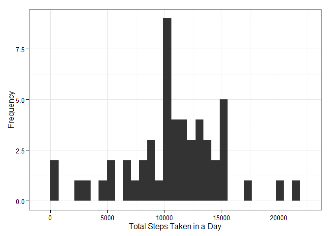
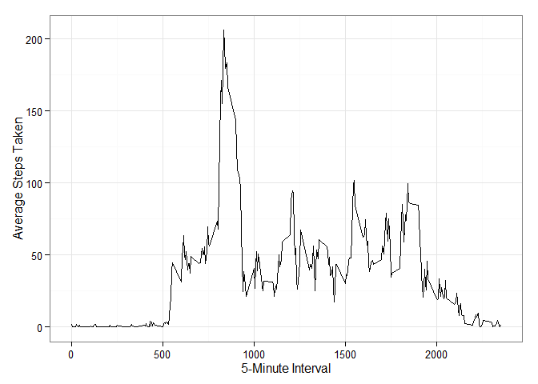
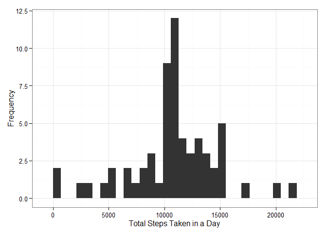
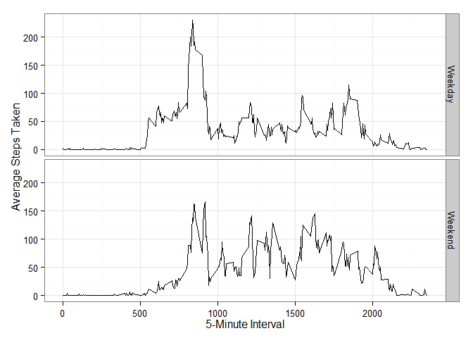

# Reproducible Research: Peer Assessment 1

This analysis focuses on data from an individual's personal activity monitoring device. The data set includes information on the number of steps taken during 5-minute intervals for each day in October and November 2012.

## Loading and preprocessing the data
After navigating to the directory in which the data file is stored, load the data and do a quick summary of the variables.


```r
df <- read.csv("./activity.csv")
summary(df)
```

```
##      steps                date          interval     
##  Min.   :  0.00   2012-10-01:  288   Min.   :   0.0  
##  1st Qu.:  0.00   2012-10-02:  288   1st Qu.: 588.8  
##  Median :  0.00   2012-10-03:  288   Median :1177.5  
##  Mean   : 37.38   2012-10-04:  288   Mean   :1177.5  
##  3rd Qu.: 12.00   2012-10-05:  288   3rd Qu.:1766.2  
##  Max.   :806.00   2012-10-06:  288   Max.   :2355.0  
##  NA's   :2304     (Other)   :15840
```

No further processing of the data is required at this time.

## What is mean total number of steps taken per day?
Ignoring the missing values in the dataset (excluding these observations), first calculate the total number of steps taken each day.


```r
daily <- aggregate(steps~date,data=df,FUN=sum,na.rm=T)
```

A histogram can show the distribution of total steps taken in a day.


```r
require(ggplot2)
```

```
## Loading required package: ggplot2
```

```
## Warning: package 'ggplot2' was built under R version 3.0.3
```

```r
ggplot(daily, aes(x=steps)) +
   geom_histogram() + 
   ylab("Frequency") +
   xlab("Total Steps Taken in a Day") +
   theme_bw()
```

```
## stat_bin: binwidth defaulted to range/30. Use 'binwidth = x' to adjust this.
```

 

Lastly, calculate the mean and median of the total steps taken daily.


```r
mean <- mean(daily$steps)
mean
```

```
## [1] 10766.19
```

```r
median <- median(daily$steps)
median
```

```
## [1] 10765
```

The mean number of steps taken daily was 10766 and the median number of steps taken daily was 10765.

## What is the average daily activity pattern?
Again, ignoring any missing value (excluding these observations), the following figure shows the average number of steps taken in each 5-minute interval across all days.


```r
int <- aggregate(steps~interval,data=df,FUN="mean",na.rm=T)

ggplot(int, aes(x=interval, y=steps)) +
   geom_line() +
   ylab("Average Steps Taken") +
   xlab("5-Minute Interval") +
   theme_bw()
```

 

```r
max <- int[order(-int$steps),][1,]
max
```

```
##     interval    steps
## 104      835 206.1698
```

Inteval 835 has the maximum average number of steps with 206.2.

## Imputing missing values
We can count the number of observations with missing information.


```r
table(is.na(df$steps))
```

```
## 
## FALSE  TRUE 
## 15264  2304
```

There are 2304 intervals where the number of steps taken is missing. I will fill in each missing value with the average number of steps taken in that interval across all days. 


```r
df2 <- merge(df,int,by=c("interval"))
df2$steps <- ifelse(!is.na(df2$steps.x),df2$steps.x,df2$steps.y)
df2 <- subset(df2,select=c("interval","date","steps"))
```

After filling in the missing values, we can look at another histogram of total steps taken each day.


```r
daily2 <- aggregate(steps~date,data=df2,FUN=sum)
ggplot(daily2, aes(x=steps)) +
   geom_histogram() + 
   ylab("Frequency") +
   xlab("Total Steps Taken in a Day") +
   theme_bw()
```

```
## stat_bin: binwidth defaulted to range/30. Use 'binwidth = x' to adjust this.
```

 

```r
mean2 <- mean(daily2$steps)
mean2
```

```
## [1] 10766.19
```

```r
median2 <- median(daily2$steps)
median2
```

```
## [1] 10766.19
```

The mean number of steps taken daily was 10766 and the median number of steps taken daily was 10766. The mean was unchanged and the median was slightly higher after imputing the missing values. It makes sense that mean was unchanged because a mean value was used when imputing the missing values.

## Are there differences in activity patterns between weekdays and weekends?

First, we need to create a factor variable indicating whether each observation comes from a weekday or weekend.


```r
df2$weekend <- ifelse((weekdays(as.Date(df2$date))=="Saturday" | weekdays(as.Date(df2$date))=="Sunday"),"Weekend","Weekday")
```

We can look at the average number of steps taken in each interval for weekdays and weekends using the imputed missing values data set. 


```r
int2 <- aggregate(steps~interval + weekend,data=df2,FUN="mean")
ggplot(int2, aes(x=interval, y=steps)) +
   geom_line() +
   facet_grid(weekend ~ .) +
   ylab("Average Steps Taken") +
   xlab("5-Minute Interval") +
   theme_bw()
```

 
